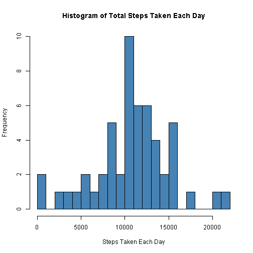
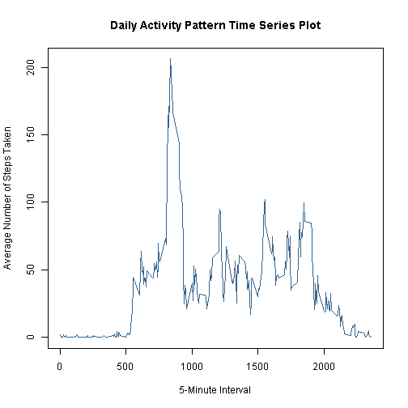
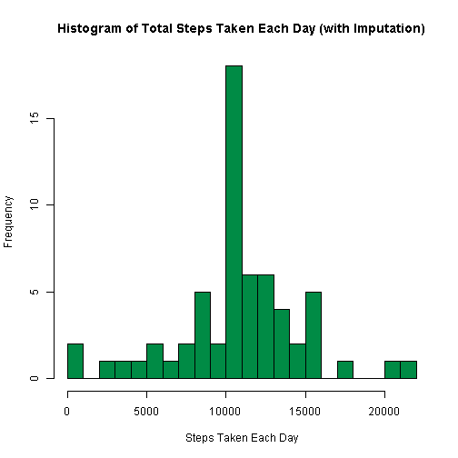
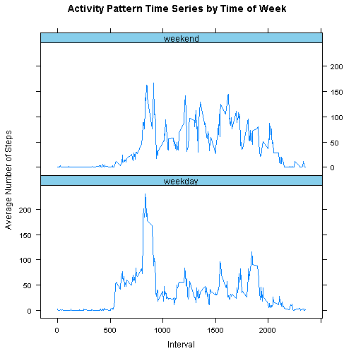

Analysis of Activity Monitoring Data
========================================================

## Loading and preprocessing the data

Load the data, convert dates to date objects:


```r
# the activity.csv file is assumed to be in the working directory
activity <- read.csv("activity.csv")

# convert activity$date to date object
activity$date <- as.Date(activity$date, format = "%Y-%m-%d")
class(activity$date)
```

```
## [1] "Date"
```


## What is the mean total number of steps taken per day?

For this part of the assignment, you can ignore the missing values in the dataset.

Make a histogram of the total number of steps taken each day:


```r
# group dataset by day, ignore NAs
library(plyr)  #for simplicity, use the plyr package
activity.by_day <- ddply(subset(activity, !is.na(activity$steps)), .(date), 
    summarize, steps = sum(steps), intervals = length(interval))

# draw the histogram
hist(activity.by_day$steps, breaks = 20, col = "steelblue", main = "Histogram of Total Steps Taken Each Day", 
    xlab = "Steps Taken Each Day")
```

 


Calculate and report the mean and median total number of steps taken per day:


```r
summary(activity.by_day)
```

```
##       date                steps         intervals  
##  Min.   :2012-10-02   Min.   :   41   Min.   :288  
##  1st Qu.:2012-10-16   1st Qu.: 8841   1st Qu.:288  
##  Median :2012-10-29   Median :10765   Median :288  
##  Mean   :2012-10-30   Mean   :10766   Mean   :288  
##  3rd Qu.:2012-11-16   3rd Qu.:13294   3rd Qu.:288  
##  Max.   :2012-11-29   Max.   :21194   Max.   :288
```

```r
mean_steps <- mean(activity.by_day$steps)
median_steps <- median(activity.by_day$steps)

mean_steps
```

```
## [1] 10766
```

```r
median_steps
```

```
## [1] 10765
```


The mean total number of steps taken per day is 1.0766 &times; 10<sup>4</sup>.  
The median total number of steps taken per day is 10765.  

## What is the average daily activity pattern?

Make a time series plot (i.e. type = "l") of the 5-minute interval (x-axis) and the average number of steps taken, averaged across all days (y-axis):


```r
# group dataset by interval, ignore NAs

# take the average across all days (i.e., group by interval and take the
# average steps for each interval)
activity.by_interval <- ddply(subset(activity, !is.na(activity$steps)), .(interval), 
    summarize, avg_steps = mean(steps))

# plot the time series
plot(activity.by_interval$interval, activity.by_interval$avg_steps, type = "l", 
    col = "steelblue4", main = "Daily Activity Pattern Time Series Plot", xlab = "5-Minute Interval", 
    ylab = "Average Number of Steps Taken")
```

 


Which 5-minute interval, on average across all the days in the dataset, contains the maximum number of steps?


```r
max_interval <- activity.by_interval[which.max(activity.by_interval$avg_steps), 
    ]$interval
max_interval
```

```
## [1] 835
```


The 5-minute interval, on average across all the days in the dataset, that contains the maximum number of steps is interval 835. The plot visually confirms this.

## Imputing missing values

Calculate and report the total number of missing values in the dataset (i.e. the total number of rows with NAs):


```r
sum(is.na(activity$interval))
```

```
## [1] 0
```

```r
sum(is.na(activity$date))
```

```
## [1] 0
```

```r
sum(is.na(activity$steps))
```

```
## [1] 2304
```

```r

na_rows <- sum(!complete.cases(activity))
na_rows
```

```
## [1] 2304
```


There are 2304 rows with NAs.

Devise a strategy for filling in all of the missing values in the dataset. The strategy does not need to be sophisticated. For example, you could use the mean/median for that day, or the mean for that 5-minute interval, etc.

Note: The only missing values are in the steps column. The chosen imputation scheme will be to use the mean steps for the given 5-minute interval (from the activity.by_interval dataset).

Create a new dataset that is equal to the original dataset but with the missing data filled in.


```r
# merge activity and activity.by_interval based on interval key

# this will create a new data frame with an extra column, avg_steps, that
# lists the average steps for the given interval
activity.imputed <- merge(activity, activity.by_interval, by = "interval")

# replace NA values for steps with avg_steps
nas = is.na(activity.imputed$steps)
activity.imputed[nas, ]$steps <- activity.imputed[nas, ]$avg_steps

# verify replacement (NA count expected to be 0)
sum(!complete.cases(activity.imputed))
```

```
## [1] 0
```


Make a histogram of the total number of steps taken each day and calculate and report the mean and median total number of steps taken per day. Do these values differ from the estimates from the first part of the assignment? What is the impact of imputing missing data on the estimates of the total daily number of steps?


```r
# again, group by day, this time using the imputed dataset
activity.by_day2 <- ddply(activity.imputed, .(date), summarize, steps = sum(steps), 
    intervals = length(interval))

# draw the histogram
hist(activity.by_day2$steps, breaks = 20, col = "springgreen4", main = "Histogram of Total Steps Taken Each Day (with Imputation)", 
    xlab = "Steps Taken Each Day")
```

 

```r

# find the mean and median
mean_steps2 <- mean(activity.by_day2$steps)
median_steps2 <- median(activity.by_day2$steps)

mean_steps2
```

```
## [1] 10766
```

```r
median_steps2
```

```
## [1] 10766
```


The mean number of steps for the imputed data is 1.0766 &times; 10<sup>4</sup>.   
The median number of steps for the imputed data is 1.0766 &times; 10<sup>4</sup>.  

The impact of imputing the missing data on the estimates of the total daily number of steps is that the mean does not seem to have changed while the median has increased by 1.1887. It seems that imputing the data has pushed the median toward the mean.

## Are there differences in activity patterns between weekdays and weekends?

Create a new factor variable in the dataset with two levels - "weekday" and "weekend" indicating whether a given date is a weekday or weekend day.


```r
# add a weekday column for verification
activity.imputed$day <- weekdays(activity.imputed$date)

# add a timeofweek column
activity.imputed$timeofweek <- factor(activity.imputed$day)

# levels
levels(activity.imputed$timeofweek)
```

```
## [1] "Friday"    "Monday"    "Saturday"  "Sunday"    "Thursday"  "Tuesday"  
## [7] "Wednesday"
```

```r

# reset levels to weekday or weekend

# rep is used to repeat the string for the various level conversions (day to
# time of week)
levels(activity.imputed$timeofweek) <- c(rep("weekday", 2), rep("weekend", 2), 
    rep("weekday", 3))

# verify the levels are reset correctly
levels(activity.imputed$timeofweek)
```

```
## [1] "weekday" "weekend"
```

```r
head(activity.imputed)
```

```
##   interval steps       date avg_steps      day timeofweek
## 1        0 1.717 2012-10-01     1.717   Monday    weekday
## 2        0 0.000 2012-11-23     1.717   Friday    weekday
## 3        0 0.000 2012-10-28     1.717   Sunday    weekend
## 4        0 0.000 2012-11-06     1.717  Tuesday    weekday
## 5        0 0.000 2012-11-24     1.717 Saturday    weekend
## 6        0 0.000 2012-11-15     1.717 Thursday    weekday
```


Make a panel plot containing a time series plot (i.e. type = "l") of the 5-minute interval (x-axis) and the average number of steps taken, averaged across all weekday days or weekend days (y-axis):
                     

```r
# group imputed dataset by interval

# take the average across all days (i.e., group by interval and take the
# average steps for each interval)
activity.by_interval2 <- ddply(activity.imputed, .(interval, timeofweek), summarize, 
    avg_steps = mean(steps))

library(lattice)

trellis.par.set(strip.background = list(col = "skyblue"))

xyplot(avg_steps ~ interval | timeofweek, data = activity.by_interval2, layout = c(1, 
    2), type = c("l"), main = "Activity Pattern Time Series by Time of Week", 
    xlab = "Interval", ylab = "Average Number of Steps")
```

 


Looking at the above plot, it seems that on weekdays there is more activity during the early day than on weekends. There is generally more activity on weekends later in the day (after around 10 AM). This may fit with expected norms. The person may work on weekdays and be less active when returning home. On weekends, the person may be less active in the morning but more active at night for leisure reasons. Further investigation would have to be conducted to determine if this was really the case.
